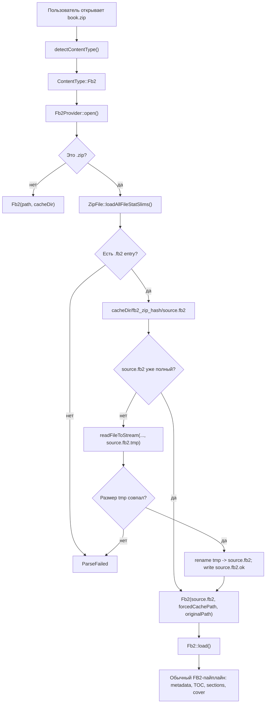

# Papyrix Reader FB2.ZIP branch

Этот файл описывает рабочую копию проекта `papyrix-reader-fb2zip` и изменения,
которые добавляют поддержку книг FictionBook (`.fb2`), упакованных в ZIP-архив
(`.zip`, практический формат файлов: `book.fb2.zip`).

Базовый проект: `bigbag/papyrix-reader`.

Локальная папка проекта:

```text
C:\Users\Alexander\Claude\papyrix-reader-fb2zip
```

## Цель изменений

Добавить возможность открывать ZIP-архивы, внутри которых лежит FB2-файл, без
переписывания существующего FB2-парсера.

Главная идея: при открытии `.zip` архив потоково распаковывается на SD-карту в
кэш книги, после чего существующий класс `Fb2` работает с распакованным
`source.fb2` как с обычным файлом.

Такой подход выбран потому, что текущий FB2-парсер использует произвольный
доступ к файлу (`seek`) для сканирования секций, метаданных и обложек. ZIP-поток
после deflate-декомпрессии не дает дешевого произвольного доступа, поэтому
передавать поток напрямую в `Fb2` нельзя без крупной переработки.

## Итоговое поведение

Теперь ридер:

- показывает `.zip` в списке поддерживаемых книг;
- использует единый фильтр поддерживаемых книг в SD-браузере, чтобы список на
  устройстве не расходился с `FsHelpers`;
- определяет `.zip` как FB2-контент;
- при открытии ZIP ищет внутри первый `.fb2` файл;
- распаковывает найденный FB2 в кэш книги;
- повторно использует уже распакованный файл, если размер и marker совпадают с
  данными `.fb2` entry внутри ZIP;
- передает путь к распакованному файлу обычному `Fb2`;
- использует имя исходного ZIP как fallback-название книги, если в FB2 нет
  собственного `<book-title>`;
- принимает `.zip` через встроенный web upload;
- устойчиво читает ZIP с EOCD comment до стандартных 65535 байт;
- для FB2 с embedded progressive JPEG cover, который `picojpeg` не умеет
  декодировать, генерирует fallback `cover.bmp`, чтобы книга не оставалась без
  обложки/thumbnail.

## Измененные файлы

### `lib/FsHelpers/src/FsHelpers.h`

Добавлен helper для ZIP:

```cpp
static inline bool isZipFile(const char* path) { return hasExtension(path, ".zip"); }
static inline bool isZipFile(const std::string& path) { return isZipFile(path.c_str()); }
```

`isSupportedBookFile()` теперь включает ZIP:

```cpp
return isEpubFile(path) || isXtcFile(path) || isTxtFile(path) ||
       isMarkdownFile(path) || isFb2File(path) || isZipFile(path) ||
       isHtmlFile(path);
```

Назначение: файловый менеджер больше не скрывает `.zip` как неподдерживаемый
формат.

### `src/content/ContentTypes.cpp`

`.zip` маршрутизируется в FB2-провайдер:

```cpp
if (strcasecmp(ext, ".zip") == 0) {
  return ContentType::Fb2;
}
```

Назначение: общая система открытия контента использует существующий
`Fb2Provider`.

### `src/content/Fb2Provider.cpp`

Добавлена подготовка пути к FB2 перед созданием объекта `Fb2`.

Новая логика:

1. Если путь не `.zip`, все работает как раньше.
2. Если путь `.zip`, создается `ZipFile`.
3. Через `loadAllFileStatSlims()` читается central directory ZIP.
4. В списке entries выбирается `.fb2`.
5. Для ZIP создается кэш:

```text
<cacheDir>/fb2_zip_<hash>/
```

6. FB2 извлекается атомарно через временный файл:

```text
<cacheDir>/fb2_zip_<hash>/source.fb2
<cacheDir>/fb2_zip_<hash>/source.fb2.tmp
```

7. Распаковка выполняется потоково:

```cpp
zip.readFileToStream(fb2EntryName.c_str(), outFile, 4096);
```

8. После успешной распаковки `source.fb2.tmp` проверяется по размеру и
   переименовывается в `source.fb2`.

9. Рядом создается marker:

```text
<cacheDir>/fb2_zip_<hash>/source.fb2.ok
```

В marker записываются:

```text
<fb2 entry name>
<uncompressed size>
<crc32>
```

10. Если `source.fb2` уже существует, он переиспользуется только при совпадении
    размера и marker. Это защищает от неполной распаковки, старого кеша без
    marker и замены ZIP-файла на другой с тем же путем.

11. Если распаковка не удалась, временный файл удаляется.

Ошибки:

- ZIP не читается: `Error::ParseFailed`;
- внутри ZIP нет `.fb2`: `Error::ParseFailed`;
- не удалось создать директорию/файл в кэше: `Error::IOError`;
- распаковка завершилась ошибкой: `Error::ParseFailed`.

### `lib/Fb2/src/Fb2.h`

Конструктор `Fb2` расширен двумя опциональными параметрами:

```cpp
explicit Fb2(std::string filepath, const std::string& cacheDir,
             std::string forcedCachePath = "",
             std::string originalPath = "");
```

Старый код, который создает `Fb2(filepath, cacheDir)`, остается совместимым.

### `lib/Fb2/src/Fb2.cpp`

Добавлена поддержка принудительного cache path:

```cpp
if (!forcedCachePath.empty()) {
  cachePath = std::move(forcedCachePath);
} else {
  cachePath = cacheDir + "/fb2_" +
              std::to_string(std::hash<std::string>{}(this->filepath));
}
```

Для ZIP-книг это важно: распакованный `source.fb2` лежит в той же папке, что и
метаданные, секции, обложки и page cache. Поэтому штатная очистка кэша FB2
удаляет и распакованный файл.

Также fallback-title теперь может строиться из `originalPath`, то есть из имени
исходного `.zip`, а не из технического `source.fb2`.

Добавлен fallback для embedded cover:

- `Fb2` по-прежнему сначала пытается извлечь `<binary>` cover и сконвертировать
  реальную картинку через общий `ImageConverter`;
- если embedded cover извлечен, но конвертер вернул ошибку (типичный случай:
  progressive JPEG / SOF2, который `picojpeg` не поддерживает), создается
  простой 1-bit `cover.bmp`-placeholder;
- старые `.cover.failed` и `.thumb.failed` для FB2 с embedded cover больше не
  блокируют повторную попытку после обновления прошивки.

Это не добавляет полноценный progressive JPEG decoder, но гарантирует, что книга
с неподдерживаемой embedded cover не останется без обложки на home/sleep screen.

### `lib/ZipFile/src/ZipFile.h`

В `ZipFile::FileStatSlim` добавлен `crc32` из central directory:

```cpp
uint32_t crc32;
```

Назначение: marker `source.fb2.ok` может проверять не только размер, но и CRC
FB2-entry внутри ZIP.

### `lib/ZipFile/src/ZipFile.cpp`

Изменения:

- чтение central directory теперь сохраняет CRC-32 entry;
- поиск EOCD расширен с последних 1 КБ до стандартного диапазона ZIP:
  `22 + 65535` байт.

Назначение: открывать ZIP-архивы с длинным comment и надежнее валидировать
кешированную распаковку.

### `src/network/html/AppPage.html`

В список разрешенных файлов для вкладки books добавлено `.zip`:

```js
accept: '.epub,.fb2,.zip,.xtc,...'
```

Назначение: ZIP с FB2 можно загрузить через встроенный web server.

### `src/states/FileListState.cpp`

Файловый браузер на устройстве раньше имел отдельный hardcoded-список
расширений:

```cpp
epub, xtc, xtch, xtg, xth, txt, md, markdown, fb2, html, htm
```

Из-за этого `.zip` был уже добавлен в `FsHelpers`, `ContentTypes` и web upload,
но все равно не отображался в списке файлов на SD-карте.

Фильтр `FileListState::isSupportedFile()` теперь использует единый helper:

```cpp
return FsHelpers::isSupportedBookFile(name);
```

Назначение: SD-браузер показывает ровно те book-файлы, которые считает
поддерживаемыми общий слой `FsHelpers`.

### `src/states/SleepState.cpp`

Добавлена поддержка ZIP-книг при генерации sleep-screen с обложкой последней
открытой книги.

Для обычного `.fb2` используется прямой `Fb2`, как и раньше. Для `.zip`
используется `Fb2Provider`, чтобы пройти тот же путь подготовки:

```cpp
Fb2Provider fb2Provider;
fb2Provider.open(bookPath, cacheDir);
```

Назначение: если последняя книга была `book.zip`, sleep-screen может получить
обложку из распакованного FB2 через общий ZIP-пайплайн.

## Архитектура открытия FB2.ZIP



## Почему не прямое чтение из ZIP

`Fb2` активно использует `seek()`:

- для поиска границ секций;
- для генерации section files;
- для повторного чтения частей документа;
- для извлечения embedded cover из `<binary>`.

Deflated ZIP-entry дает последовательный поток. Чтобы делать произвольный
доступ внутри такого потока, пришлось бы либо держать распакованный FB2 в RAM,
либо строить сложный индекс deflate-blocks. Для ESP32-C3 это хуже по памяти,
сложности и риску.

Текущий вариант распаковывает файл на SD-карту чанками по 4096 байт и затем
использует уже отлаженный FB2-код.

## Кэширование

Для обычного FB2 кэш остается прежним:

```text
<cacheDir>/fb2_<hash(filepath)>/
```

Для ZIP с FB2 используется:

```text
<cacheDir>/fb2_zip_<hash(zipPath)>/
```

Внутри:

```text
source.fb2
source.fb2.ok
meta.bin
section_0.fb2
section_1.fb2
...
cover.bmp
thumb.bmp
pages_0.bin
...
```

Переоткрытие книги:

1. `Fb2Provider` снова читает central directory ZIP.
2. Находит тот же `.fb2` entry.
3. Проверяет, существует ли `source.fb2`.
4. Проверяет marker `source.fb2.ok`.
5. Сравнивает размер `source.fb2` с `uncompressedSize` из ZIP.
6. Сравнивает marker с entry name, размером и CRC-32.
7. Если все совпадает, распаковка пропускается.

## Ограничения

- Если в ZIP лежит несколько `.fb2`, открывается лексикографически первый путь.
  Это сделано детерминированно, чтобы результат не зависел от порядка
  `unordered_map`.
- Если внутри ZIP нет `.fb2`, книга не откроется.
- Внешние изображения рядом с FB2 внутри ZIP не извлекаются.
- Embedded cover в самом FB2 (`<binary>`) извлекается. Baseline JPEG/PNG/BMP
  конвертируются в реальную обложку. Progressive JPEG не декодируется текущим
  `picojpeg`; для него генерируется fallback `cover.bmp`.
- Распакованный FB2 занимает место на SD-карте, но лежит в папке кэша книги и
  удаляется вместе с ней при очистке кэша.
- Поддерживаются обычные ZIP compression methods, которые уже поддерживает
  `ZipFile`: stored и deflated.

## Проверка сборки

Проверка выполнялась командой:

```powershell
pio run
```

Для корректной сборки в Windows в `PATH` добавлены:

```text
C:\Users\Alexander\.platformio\penv\Scripts
C:\Users\Alexander\.platformio\packages\toolchain-riscv32-esp\bin
```

Итог проверки:

- `ZipFileErrorPathTest` прошел: 25/25;
- `pio run` завершился успешно;
- создан firmware:

```text
C:\Users\Alexander\Claude\papyrix-reader-fb2zip\.pio\build\default\firmware.bin
```

Последний собранный файл:

```text
Размер: 4,280,592 bytes
Дата: 2026-06-05 15:35:37
```

Во время сборки были предупреждения из существующего кода проекта, не связанные
с изменениями FB2.ZIP.

## Git status после изменений

Ожидаемые измененные файлы:

```text
lib/Fb2/src/Fb2.cpp
lib/Fb2/src/Fb2.h
lib/FsHelpers/src/FsHelpers.h
lib/ZipFile/src/ZipFile.cpp
lib/ZipFile/src/ZipFile.h
src/content/ContentTypes.cpp
src/content/Fb2Provider.cpp
src/network/html/AppPage.html
src/states/FileListState.cpp
src/states/SleepState.cpp
test/mocks/SDCardManager.h
tools/reader-test/mocks/SDCardManager.h
PROJECT_FB2ZIP.md
```

## Практический сценарий тестирования на устройстве

1. Подготовить ZIP:

```text
book.fb2.zip
└── book.fb2
```

2. Скопировать `book.fb2.zip` на SD-карту или загрузить через web interface.
3. Открыть книгу из файлового списка.
4. При первом открытии ридер распакует FB2 в cache directory.
5. При повторном открытии распаковка должна быть пропущена.
6. Проверить:

- название книги;
- автора;
- TOC;
- переходы по секциям;
- сохранение прогресса;
- очистку кэша.

Дополнительно проверенный реальный случай:

- `Zygar_Vsya-kremlevskaya-rat.7TinDA.856850.fb2.zip` — embedded baseline JPEG
  cover конвертируется в реальную обложку;
- `Коткин. Предотвращенный Армагеддон. Распад Советского Союза, 1970–2000.fb2.zip`
  — embedded progressive JPEG cover не поддерживается `picojpeg`, поэтому
  прошивка должна создать fallback `cover.bmp` и затем `thumb.bmp`.

## Возможные будущие улучшения

- Показывать более понятное сообщение, если ZIP не содержит `.fb2`.
- Поддержать выбор FB2, если в архиве несколько книг.
- Извлекать внешние изображения рядом с FB2 из того же ZIP.
- Подключить другой JPEG decoder или host-side preprocessing, если нужна
  настоящая обложка для progressive JPEG вместо fallback.
- Добавить unit/integration test на `prepareFb2Path()` с моками `ZipFile` и
  `SDCardManager`.
- Добавить явное отображение формата `FB2.ZIP` в UI metadata.

## GitHub fork

Создан fork upstream-репозитория:

```text
https://github.com/alrudimgn/papyrix-reader-fb2zip
```

В рабочей копии добавлен remote:

```text
fork  https://github.com/alrudimgn/papyrix-reader-fb2zip.git
```

`origin` в этой рабочей копии по-прежнему указывает на локальную папку:

```text
C:\Users\Alexander\Claude\papyrix-reader-github
```
